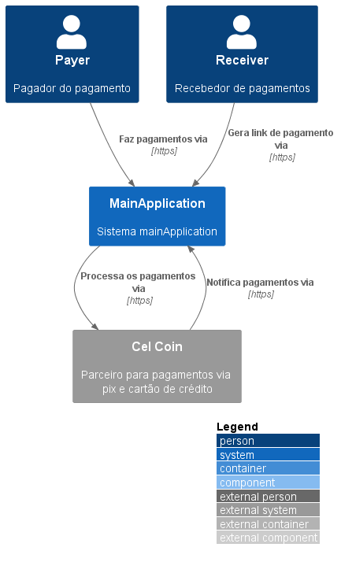
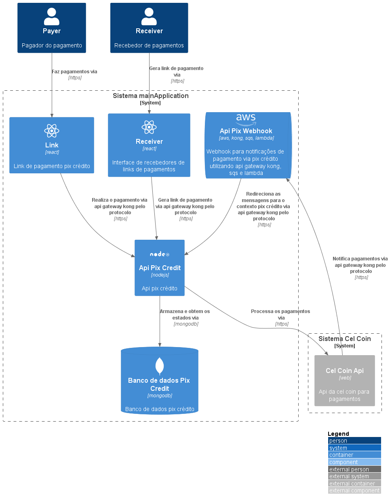
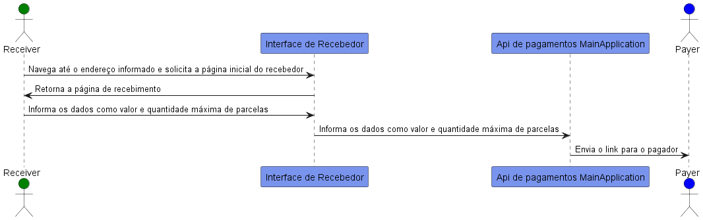
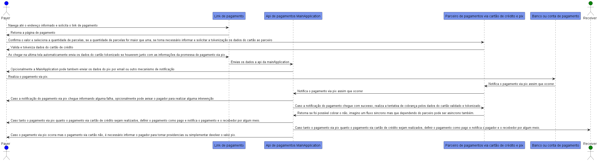
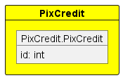

# Pix crédito por Luiz Carlos Douglas de Jesus

## Introdução

Partindo dos pressupostos:

- A integração pix crédito será através das apis do parceiro cell coin.
- Existe um forma prévia do recebedor enviar para o pagador um link com a definição inicial do valor e opções de parcelamento.
- Na prática o sistema do pix só será utilizado para a primeira parcela, as demais serão pagas atráves de um cartão de crédito de forma parcelada, limitada ao limite do cartão.

Embora o pagamento não seje totalmente feito via pix, me parece rasoável, principalmente da pespectiva de modelagem de domínio, que o pagamento deva acontecer como uma transação única.

Na minha visão, o cartão de crédito deve ser validado antes de exibir as informações de pagamento via pix, em sequida na notificação de pagamento com sucesso via pix o sistema deve tentar realizar a cobrança via cartão de crédito, que pode falhar por inúmeros motivos, incluindo falta de saldo e logo depois ao obter a resposta da tentativa em caso de falha, podemos
implementar uma sugestão de troca das informações do cartão de forma asincrona, e não sendo possível mesmo depois de um tempo a primeira parcela via pix precisaria ser estornada ou devolvida de alguma forma.

Posso não estar entendendo bem, mas me parece que a etapa de pagamento do QR Code do pix bloquea o restando do fluxo aguardando confirmação, como uma etapa atômica e em seguida na próxima etapa é feito o pagamento via cartão de crédito também como uma etapa atômica.
Conjecturo que um front end rico orquestará essas operações garatindo a atômicidade final do fluxo.

Se de fato for essa a intenção gostaria de sugerir que a geração do QR Code fique apenas no
final, depois dos dados do cartão já terem sido preenchidos, dessa forma poderemos subemeter apenas uma operação atômica e final ao backend e orquestar toda a operação por lá, de preferência utilizando conceitos como domain driver design e arquitetura limpa, mao não necessariamente.

Mesmo na sequência atual, caso o pagamento do qr code não seja bloqueante, ainda podemos orquestar tudo no back end, utilizando de uma ou mais requisições a api, entretando caso o cliente pague o qr code e por alguma imprevisto não tenha adicionado os dados do cartão, como em uma caso raro onde o celular acabou a bateria ou o computador/celular simplesmente parou de funcionar, ao receber a mensagem de pagamento via pix o processo não poderia ser concluido até que o pagamento via cartão seja finalizado de alguma forma, filas asincronas consegueriam garantir a resiliência do processo, mas é uma situação que gostaria de evitar.

Também podemos mantar o pagamento como algo não atômico e parcial, mas essa não seria minha visão inicial, de toda forma a infraestrutura precisa estar aberta a melhor esperiência do usuário, então estaria disposto a alterações estruturais a fim de otimitizar a satisfação do cliente.

## Arquitetura da Solução

<!-- ### Índice

- [C4](#c4)
- [UML](#uml)
  - [Diagramas de Sequencia](#sequência)
- [BPMN](#bpmn) -->

#### Diagramas C4

##### Diagrama C1 - Sistemas

##### Diagrama C2 - Containers

## Arquitetura de Software

Detalhes arquiteturais que fazem parte da implementação do software

##### Diagrama de Sequência - Casos de uso - Criação Link de Pagamento Pix Crédito

##### Diagrama de Sequência - Casos de uso - Pagamento Pix Crédito

<!--
### Modelos de Domínio de Negócio

#### Contextos Delimitados

 -->

<!-- #### Mapa de Contextos

 -->

<!-- ### Modelos de Schemas de Base de Dados

Sugiro a utilização de uma obordagem de persistencia de agregados, dessa forma para cada agragado sera mapeada uma collection no mongodb com praticamente a mesma estrutura, apensa sera adicionado a data de criação e alteração que não serão necessariamente mapeadas para a estrutura de domínio. -->

<!-- ## Arquitetura de Software - Pix Credit Front End

Arquiterura da implementação do front end Pix Credit

## Arquitetura?

### Índice

- [Personas](#personas)
- [Uso do Pix Crédito](#uso-do-pix-crédito)
  - [Uso do crédito](#uso-do-crédito)
  - [Pagamento da fatura](#pagamento-da-fatura)
  - [Saque do dinheiro](#saque-do-dinheiro)
- [Aprovação de crédito](#aprovação-de-crédito)
- [Riscos para a _issuer_](#riscos-para-a-issuer)

### Observações

issuer de crédito
customer de uma transação
o shopper de um customer
seller de uma transação -->
